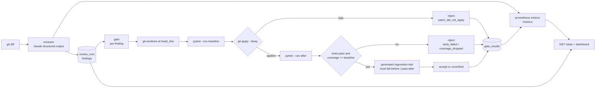

# agentdiff

agentdiff reviews git diffs with an LLM and refuses to trust it. Every suggested patch is
checked out into an isolated `git worktree`, the repository's own pytest suite is run before and
after, and a suggestion is only accepted if the tests still pass and coverage does not drop.
Rejected suggestions never fail the build — that is the whole point of the gate. A second
LLM pass generates a regression test for accepted patches, which must fail on the old code and
pass on the new one; otherwise the finding is flagged `unverified` and its confidence is cut in
half. Every review, gate decision, token, and cent of cost is recorded and exported as Prometheus
metrics, and a 12-case seeded-bug corpus benchmarks the reviewer so the model can be scored
instead of trusted.

## Architecture



## Quickstart

```bash
cp .env.example .env          # fill in ANTHROPIC_API_KEY
make up                       # postgres + api + prometheus on :8000/:9090
```

- API + dashboard: http://localhost:8000 (dashboard at `/`, docs at `/docs`)
- Metrics: http://localhost:8000/metrics (Prometheus scrapes it automatically)
- Test and lint: `make test`, `make cov` (80% floor locally; CI enforces 85%)

## CLI

```bash
python -m agentdiff review --base main --head HEAD              # colored findings table
python -m agentdiff review --base main --head HEAD --json       # raw JSON
python -m agentdiff gate --base main --head HEAD                # review + gate summary
python -m agentdiff gate --base main --head HEAD --fail-on blocker   # exit 1 on accepted blockers
python -m agentdiff bench --model claude-opus-5 --effort high   # benchmark + scoreboard
python -m agentdiff serve --port 8000                           # run the API
```

`gate` exits non-zero only when an **accepted** finding meets or exceeds `--fail-on`
(`blocker|major|minor`, default `major`). Rejected suggestions never fail the build.

## API

| Method | Path | Description |
| --- | --- | --- |
| `POST` | `/api/v1/reviews` | Review a diff. Body: `{repo, base_sha, head_sha, diff, repo_context?}`. Returns 201 with the run and its findings. `?gate=true` chains review-then-gate. |
| `GET` | `/api/v1/reviews` | Run history. `?repo=&limit=` |
| `GET` | `/api/v1/reviews/{id}` | One run with findings and gate results. |
| `POST` | `/api/v1/reviews/{id}/gate` | Gate every finding (own worktree per finding, bounded concurrency). 409 unless the run is `complete`. |
| `GET` | `/api/v1/benchmarks` | Benchmark result history. |
| `GET` | `/api/v1/benchmarks/compare?a=model@prompt@effort&b=...` | Latest results per config plus metric deltas. |
| `GET` | `/healthz` | Liveness + DB ping. |
| `GET` | `/metrics` | Prometheus exposition. |
| `GET` | `/stats?days=7` | JSON rollup: runs, acceptance rate, rejection reasons, cost, p50/p95 latency, coverage delta, benchmark false-positive rate. |

## Dashboard


Single-file Jinja2 + vanilla JS (no build step) at `/`. Polls `/stats` every 5s and renders
acceptance/rejection, rejection reasons, cost over time, latency percentiles, and the latest
benchmark precision/recall per config. Light and dark mode via `prefers-color-scheme`; every axis
is labeled with units.

## Benchmark scoreboard

Live numbers from `bench/corpus/` (8 seeded bugs + 4 clean cases), written by
`python -m agentdiff bench`:

<!-- SCOREBOARD_START -->
| config | TP | FP | FN | precision | recall | f1 | mean_latency_ms | mean_cost_usd | clean_fp_rate | cases | clean_cases |
|---|---|---|---|---|---|---|---|---|---|---|---|

**No live run yet** — the harness and corpus are in place, but the Anthropic account attached
to the project key has no credit balance, so no real numbers have been recorded.
<!-- SCOREBOARD_END -->

A low score is a finding about the reviewer, not a bug in the harness.

## Limitations

- **Patch application**: `git apply --3way` may partially merge a patch whose context lines have
  drifted; patches that add or delete whole files are not attempted. A patch that applies and
  passes tests can still change behavior in ways the suite does not observe.
- **Non-determinism**: LLM output, generated regression tests, and test-suite timing vary across
  runs. A finding accepted once may be rejected on a rerun, and vice versa.
- **Cost**: every review makes two LLM calls (review + verification) at up to 16k output tokens;
  gating adds a full pytest run per finding. Check `agentdiff_cost_usd_total` before wiring the
  gate into a busy repo.
- **What the gate cannot catch**: bugs with no test coverage (it only re-runs the existing
  suite), flaky tests that pass on the worktree but not in production, semantic regressions that
  keep coverage flat, and defects outside the changed lines. The gate verifies "does not break
  the suite" — it is not a proof of correctness.
- **Fork PRs**: the GitHub Action needs `ANTHROPIC_API_KEY`; on forks (no secrets) it skips with
  a warning rather than failing.

## Development

```bash
python3.12 -m venv .venv && .venv/bin/pip install -e ".[dev]"   # or make install
make test                                                       # 105 tests, incl. real git+pytest gate fixtures
ruff check agentdiff tests && mypy agentdiff
docker compose up --build
```
